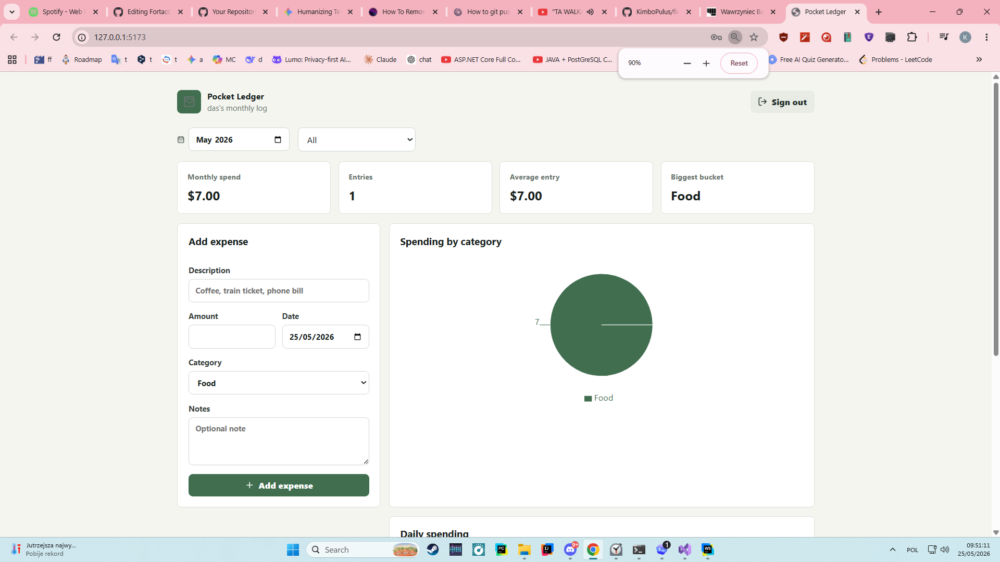
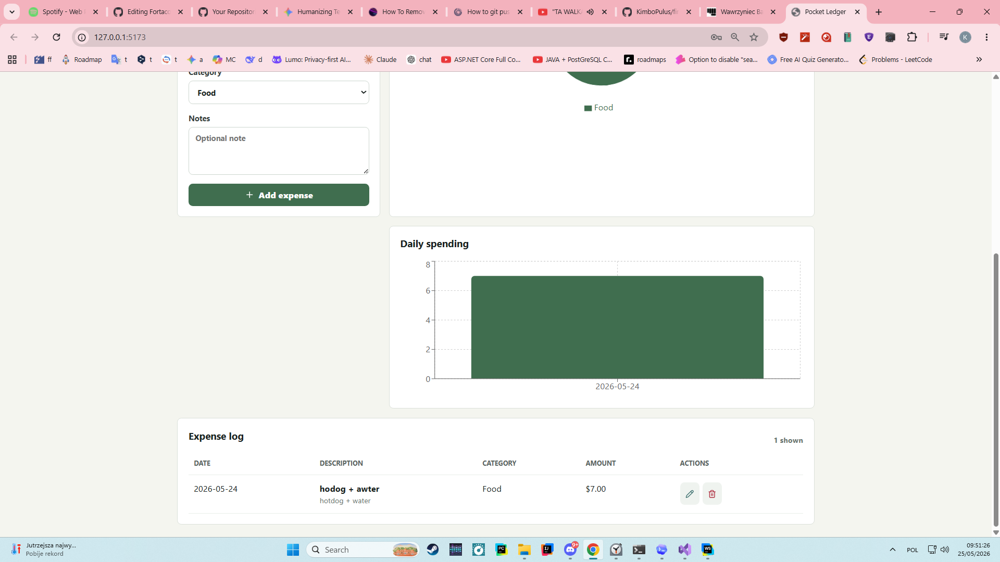

# Finance Dashboard

This is a small fullstack JavaScript project for tracking personal expenses. I built it as a practice project to work with the usual pieces of a web app: login, forms, CRUD routes, protected data, and a couple of charts.

The app lets a user make an account, add expenses, put them into categories, and see a monthly breakdown. It is not meant to be a real banking or accounting product. The data is saved in a local JSON file so the project is easy to run without setting up a database.

## Screenshots





## Tech Used

- React
- Vite
- React Router
- Recharts
- Node.js
- Express
- JSON Web Tokens
- bcryptjs

## How to Run

Open the project folder in WebStorm:

`C:\Users\Max\WebstormProjects\finance-dashboard`

Install everything:

```bash
npm install
```

Start the frontend and backend:

```bash
npm run dev
```

Then open:

```text
http://127.0.0.1:5173
```

The API runs on port `4000`. The frontend uses Vite's proxy so calls to `/api` go to the Express server.

## Project Structure

```text
client/                 React frontend
server/                 Express backend
server/src/routes.js    Main API routes
server/src/auth.js      JWT auth middleware
server/src/db.js        Local JSON file read/write helpers
docs/images/            Screenshots used in this README
```

## Features

- register and log in
- keep expenses private per user
- add expenses
- edit expenses
- delete expenses
- filter by month and category
- show category spending in a pie chart
- show daily spending in a bar chart

## API Routes

```text
POST   /api/auth/register
POST   /api/auth/login
GET    /api/auth/me

GET    /api/expenses
POST   /api/expenses
PUT    /api/expenses/:id
DELETE /api/expenses/:id

GET    /api/summary?month=YYYY-MM
```

## Resetting Local Data

The app creates this file while running:

```text
server/data/db.json
```

To reset the local accounts and expenses, stop the server and delete that file. It will be created again the next time the backend starts.

## Things I Would Improve Later

- use a real database instead of a JSON file
- add budget limits per category
- add search by description
- add better form validation messages
- add tests for the API routes
- deploy the frontend and backend
